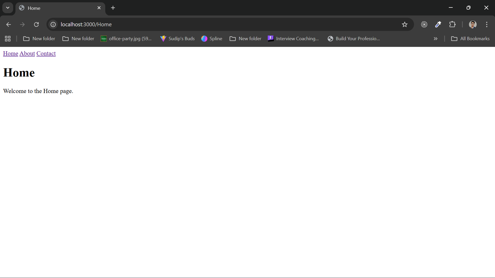
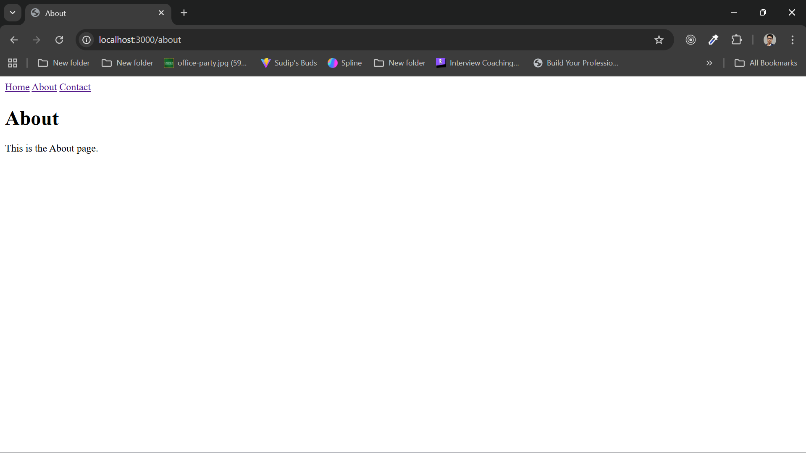
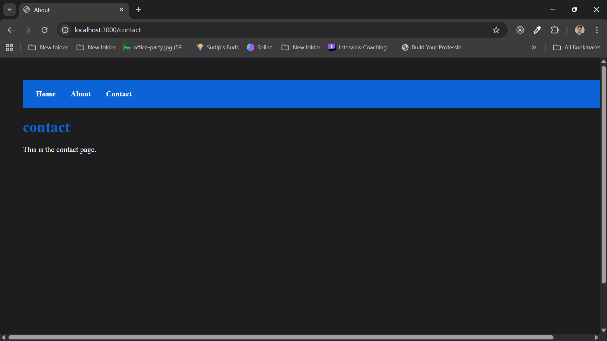
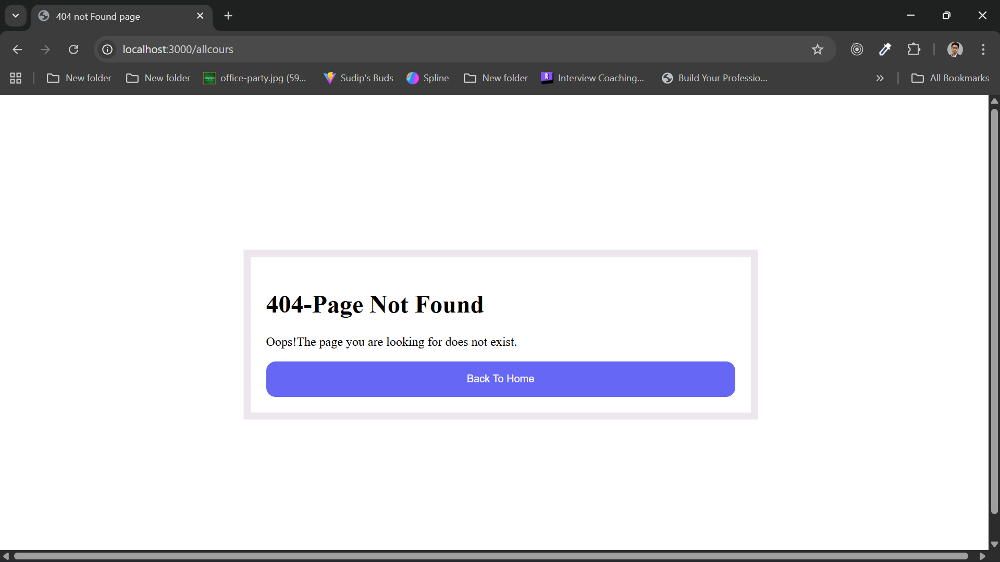

# SimpleWebServerwith-Node.js =====

** This project is a simple Node.js server created using the built-in 'http' module. 
It serves different HTML pages (Home, About, Contact) based on the route 
and shows a 404 page for invalid routes....!   **

project-folder/
│-- server.js          
│-- pages/
│    ├── home.html
│    ├── about.html
│    ├── contact.html
│    └── 404.html
│-- README.md

1. Open terminal and navigate to the project folder.
2. Run the command: npm start
3. Open browser and go to:
   - Home: http://localhost:3000/
   - About: http://localhost:3000/about
   - Contact: http://localhost:3000/contact
   - Invalid route: http://localhost:3000/xyz → shows 404 page (error pages)

## screenshots
### server Page

### Home Page

### About Page

### Contact Page

### 404 Page

